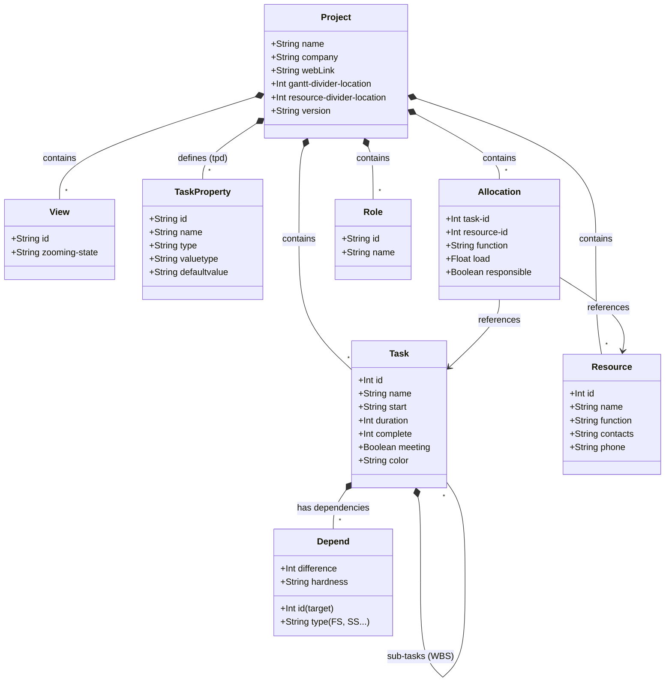

# Structure du fichier .gan (GanttProject)

Ce document fournit une spécification détaillée du format de fichier XML `.gan` utilisé par GanttProject, afin de garantir l'interopérabilité avec d'autres applications telles que **webGantt**.

## Vue d'ensemble (Modèle de Données)

## Élément Racine `<project>`
L'élément racine représente les paramètres globaux du projet.

**Attributs principaux :**
- `name` : Nom du projet.
- `company` : Nom de l'organisation.
- `webLink` : URL associée au projet.
- `gantt-divider-location` : Largeur en pixels du panneau de gauche (le tableau WBS). **Note :** Une valeur très faible (ex: `1`) est ignorée par GanttProject (limite technique Java Swing) qui affichera le panneau à sa largeur minimale par défaut.
- `resource-divider-location` : Largeur en pixels du panneau des ressources.
- `version`, `locale`, `view-date`, `view-index` : Paramètres de versioning et d'état de vue initial.

**Enfants :**
- `<description>` : Contient le texte descriptif du projet.

## Vues `<view>`
Les balises `<view>` stockent la configuration de l'interface utilisateur.

- `id="gantt-chart"` : Configure la vue principale.
  - `zooming-state` : Niveau de zoom du diagramme (ex: `default:2`).
  - `<field>` : Définit les colonnes visibles dans le tableau WBS. L'attribut `id` fait référence aux propriétés `tpd` (voir ci-dessous). L'attribut `name` n'est qu'une étiquette traduite ; l'ID est la vraie clé immuable.

## Propriétés de Tâches : Les champs `tpd` (Task Property Default)
Les colonnes et métadonnées natives sont gérées par des identifiants `tpd` internes.

### Déclarés dans `<taskproperties>`
GanttProject écrit explicitement les propriétés `tpd0` à `tpd9` dans le fichier :
- `tpd0` : Icône de Type
- `tpd1` : Icône de Priorité
- `tpd2` : Icône d'Information
- `tpd3` : Nom de la tâche
- `tpd4` : Date de début
- `tpd5` : Date de fin
- `tpd6` : Durée
- `tpd7` : Avancement (complétion)
- `tpd8` : Coordinateur / Responsable
- `tpd9` : Prédécesseurs

### Champs Implicites (non déclarés dans `<taskproperties>`)
GanttProject gère d'autres colonnes de manière native, sans les lister dans `<taskproperties>`. Elles peuvent néanmoins être appelées par leur `id` dans une `<view>` :
- `tpd10` : ID
- `tpd11` : Outline Number (Numéro hiérarchique WBS)
- `tpd12` : Coût
- `tpd13` : Ressources (Calculé à partir des `<allocations>`)
- `tpd14` : Couleur
- `tpd15` : Notes
- `tpd16` : Pièces jointes (Lien Web)
- `tpd17` : Date de début au plus tôt
- `tpd18` : Tâche critique

### Propriétés Personnalisées (`<taskproperty>`)
Les champs créés par l'utilisateur possèdent un `id` arbitraire (ex: `tpc0`, `tpc1`), un `type="custom"` et parfois un attribut `formula` contenant du code JavaScript si le champ est calculé.

## Tâches `<task>`
Imbriquées pour représenter l'arborescence (WBS).
**Attributs principaux :**
- `id` (Int) : Identifiant unique de la tâche.
- `uid` (String) : Identifiant unique interne.
- `name` (String) : Nom ou titre de la tâche.
- `start` (String, YYYY-MM-DD) : Date de début prévue.
- `duration` (Int) : Durée en jours.
- `complete` (Int, 0-100) : Pourcentage d'avancement.
- `meeting` (Boolean) : Indique si la tâche est un jalon (durée = 0).
- `color` : Couleur de la barre au format hexadécimal.
- `shape` : Entier représentant le motif de remplissage (hachures) appliqué sur la barre :
  - `0` ou non défini : Plein / Transparent (par défaut)
  - `1` : Motif par défaut (Damier)
  - `2` : Croix (Cross)
  - `3` : Lignes verticales
  - `4` : Lignes horizontales
  - `5` : Grille
  - `6` : Ronds
  - `7` à `10` : Triangles (NW, NE, SW, SE)
  - `11` : Losanges
  - `12` à `13` : Points (denses ou espacés)
  - `14` à `15` : Diagonales (Slash `///` et Backslash `\\\`)
  - `16` à `20` : Équivalents en lignes épaisses (Thick)
- `priority`, `webLink`, `expand` : Autres métadonnées natives.

**Enfants :**
- `<notes>` : Description textuelle de la tâche.
- `<customproperty>` : Pour la valeur des champs personnalisés.
- `<depend>` : Dépendance de cette tâche vers une autre :
  - `id` (Int) : ID de la tâche cible.
  - `type` (String) : Type de contrainte (ex: "FS").
  - `difference` (Int) : Décalage temporel.
  - `hardness` (String) : Dureté de la contrainte.

## Ressources et Allocations
### `<resource>`
- `id` (Int) : Identifiant de la ressource.
- `name` (String) : Nom de la personne.
- `function` (String) : Rôle (référence à `<roles>`).
- `contacts`, `phone` : Informations de contact.

### `<allocation>`
Associe une ressource à un `task-id`. C'est ce bloc qui alimente la colonne dynamique `tpd13`.
- `task-id` (Int) : ID de la tâche.
- `resource-id` (Int) : ID de la ressource.
- `function` (String) : Rôle pour cette assignation.
- `load` (Float) : Charge de travail (ex: 100.0).
- `responsible` (Boolean) : Indique si c'est le coordinateur (tpd8).

## Rôles `<roles>`
Définit le dictionnaire des fonctions/rôles assignables aux ressources.

**Enfants :**
- `<role>` : Un rôle spécifique.
  - `id` (String) : Identifiant unique du rôle (ex: `SoftwareDevelopment:1`).
  - `name` (String) : Nom d'affichage du rôle (ex: `Chef de Projet`).

## Calendriers `<calendars>`
Définit la configuration des jours ouvrés et des dates particulières du projet.

**Enfants :**
- `<day-types>` : Configuration hebdomadaire.
  - `<default-week>` : Attributs `sun`, `mon`, `tue`, `wed`, `thu`, `fri`, `sat` avec pour valeur `0` (jour ouvré) ou `1` (jour chômé/week-end).
  - `<only-show-weekends>` : Si `value="true"`, les week-ends sont traités comme des jours ouvrés dans le Gantt.
- `<date>` : Définition d'un jour particulier (ex: Jour férié).
  - `year` (String, Optionnel) : L'année. Si l'attribut est omis ou vide (`year=""`), la date est considérée comme **récurrente** (elle se répète chaque année à la même date).
  - `month`, `date` (Int) : Le mois et le jour.
  - `type` (String) : Type de jour. Valeurs possibles :
    - `HOLIDAY` : Vacances / Jour chômé.
    - `WORKING_DAY` : Jour de travail forcé.
    - `NEUTRAL` : Jour neutre.
  - `color` (String) : Couleur d'affichage dans le Gantt (ex: `#ff9999`).
  - *Texte du nœud* (CDATA) : Le nom ou résumé du jour (ex: `Nouvel An`).
