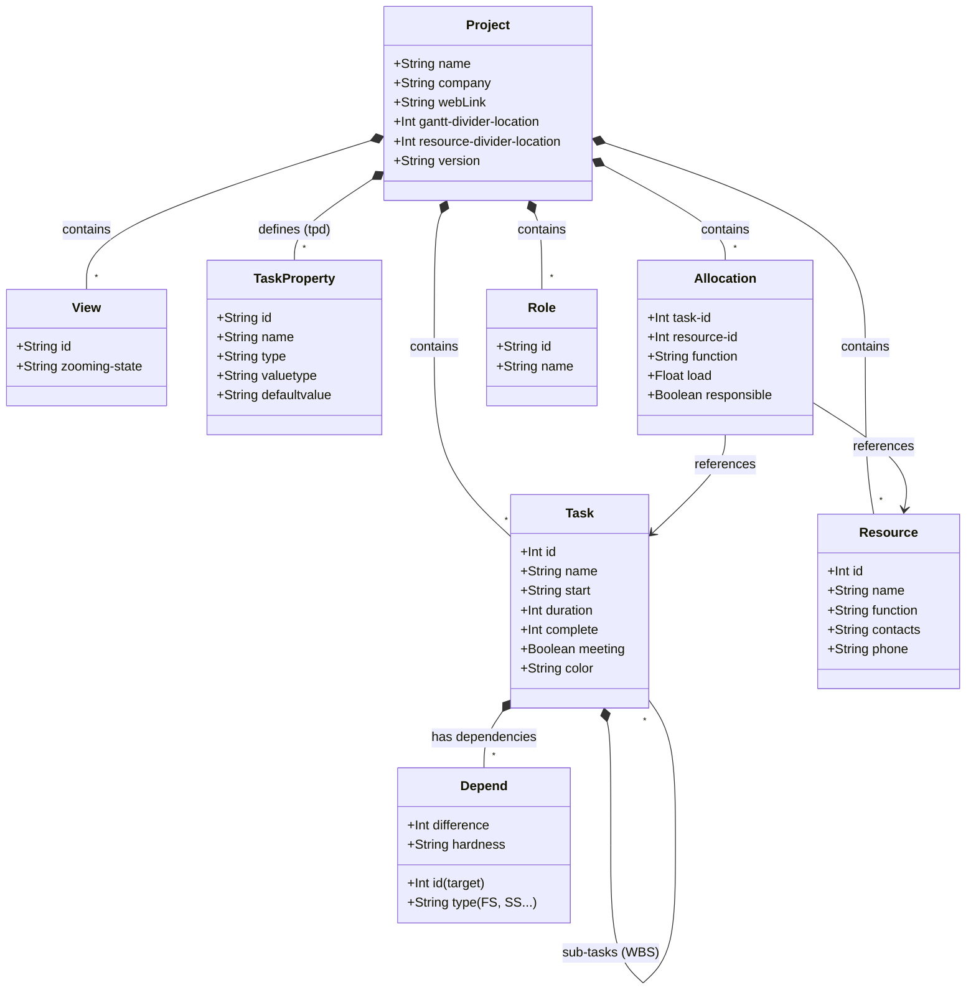

# .gan File Structure (GanttProject)

This document provides a detailed specification of the `.gan` XML file format used by GanttProject, to ensure interoperability with other applications such as **webGantt**.

## Overview (Data Model)

## Root Element `<project>`
The root element represents the global settings of the project.

**Main attributes:**
- `name` : Name of the project.
- `company` : Organization name.
- `webLink` : URL associated with the project.
- `gantt-divider-location` : Width in pixels of the left pane (the WBS table). **Note:** A very low value (e.g., `1`) is ignored by GanttProject (Java Swing technical limit) which will display the pane at its default minimum width.
- `resource-divider-location` : Width in pixels of the resources pane.
- `version`, `locale`, `view-date`, `view-index` : Versioning parameters and initial view state.

**Children:**
- `<description>` : Contains the descriptive text of the project.

## Views `<view>`
The `<view>` tags store the user interface configuration.

- `id="gantt-chart"` : Gantt chart view.
  - `zooming-state` : Zoom level of the diagram. In GanttProject, it is stored as `ganttproject-value-meta-current-gantt-gantt-chart-drawer-zoom:X` where `X` is an integer from 0 to 9 representing the index of the zoom level (defined by `GPTimeUnitStack`).
    - `0` to `3` : Main unit "Day" (Width per day: 65px, 55px, 44px, 34px).
    - `4` to `7` : Main unit "Week" (Width per week: 24px, 21px, 13px, 8px, i.e., approx. 3.4px to 1.14px per day).
    - `8` to `9` : Main unit "Month" (Width per month: 5px, 3px, i.e., approx. 0.16px to 0.1px per day).
    - *Note: The higher the value, the more zoomed out it is.*
  - `<field>` : Defines the visible columns in the WBS table. The `id` attribute refers to the `tpd` properties (see below). The `name` attribute is just a translated label; the ID is the true immutable key.

## Task Properties: The `tpd` fields (Task Property Default)
Native columns and metadata are managed by internal `tpd` identifiers.

### Declared in `<taskproperties>`
GanttProject explicitly writes the properties `tpd0` to `tpd9` in the file:
- `tpd0` : Type Icon
- `tpd1` : Priority Icon
- `tpd2` : Information Icon
- `tpd3` : Task Name
- `tpd4` : Start Date
- `tpd5` : End Date
- `tpd6` : Duration
- `tpd7` : Completion (progress)
- `tpd8` : Coordinator / Responsible
- `tpd9` : Predecessors

### Implicit Fields (not declared in `<taskproperties>`)
GanttProject natively handles other columns without listing them in `<taskproperties>`. They can nevertheless be called by their `id` in a `<view>`:
- `tpd10` : ID
- `tpd11` : Outline Number (Hierarchical WBS number)
- `tpd12` : Cost
- `tpd13` : Resources (Calculated from `<allocations>`)
- `tpd14` : Color
- `tpd15` : Notes
- `tpd16` : Attachments (Web Link)
- `tpd17` : Earliest Start Date
- `tpd18` : Critical Task

### Custom Properties (`<taskproperty>`)
Fields created by the user have an arbitrary `id` (e.g., `tpc0`, `tpc1`), a `type="custom"`, and sometimes a `formula` attribute containing JavaScript code if the field is calculated.

## Tasks `<task>`
Nested to represent the tree structure (WBS).
**Main attributes:**
- `id` (Int) : Unique identifier of the task.
- `uid` (String) : Internal unique identifier.
- `name` (String) : Name or title of the task.
- `start` (String, YYYY-MM-DD) : Planned start date.
- `duration` (Int) : Duration in days.
- `complete` (Int, 0-100) : Progress percentage.
- `meeting` (Boolean) : Indicates if the task is a milestone (duration = 0).
- `color` : Color of the bar in hexadecimal format.
- `shape` : Integer representing the fill pattern (hatching) applied to the bar:
  - `0` or undefined : Solid / Transparent (default)
  - `1` : Default pattern (Checkerboard)
  - `2` : Cross
  - `3` : Vertical lines
  - `4` : Horizontal lines
  - `5` : Grid
  - `6` : Circles
  - `7` to `10` : Triangles (NW, NE, SW, SE)
  - `11` : Diamonds
  - `12` to `13` : Dots (dense or spaced)
  - `14` to `15` : Diagonals (Slash `///` and Backslash `\\\`)
  - `16` to `20` : Equivalents in thick lines
- `priority`, `webLink`, `expand` : Other native metadata.

**Children:**
- `<notes>` : Textual description of the task.
- `<customproperty>` : For the value of custom fields.
- `<depend>` : Dependency of this task to another:
  - `id` (Int) : ID of the target task.
  - `type` (String) : Type of constraint (e.g., "FS").
  - `difference` (Int) : Time offset.
  - `hardness` (String) : Hardness of the constraint.

## Resources and Allocations
### `<resource>`
- `id` (Int) : Identifier of the resource.
- `name` (String) : Name of the person.
- `function` (String) : Role (reference to `<roles>`).
- `contacts`, `phone` : Contact information.

### `<allocation>`
Associates a resource with a `task-id`. This block feeds the dynamic column `tpd13`.
- `task-id` (Int) : ID of the task.
- `resource-id` (Int) : ID of the resource.
- `function` (String) : Role for this assignment.
- `load` (Float) : Workload (e.g., 100.0).
- `responsible` (Boolean) : Indicates if it's the coordinator (tpd8).

## Roles `<roles>`
Defines the dictionary of assignable functions/roles to resources.

**Children:**
- `<role>` : A specific role.
  - `id` (String) : Unique identifier of the role (e.g., `SoftwareDevelopment:1`).
  - `name` (String) : Display name of the role (e.g., `Project Manager`).

## Calendars `<calendars>`
Defines the configuration of working days and special dates for the project.

**Children:**
- `<day-types>` : Weekly configuration.
  - `<default-week>` : Attributes `sun`, `mon`, `tue`, `wed`, `thu`, `fri`, `sat` with value `0` (working day) or `1` (non-working day/weekend).
  - `<only-show-weekends>` : If `value="true"`, weekends are treated as working days in the Gantt chart.
- `<date>` : Definition of a specific day (e.g., Public Holiday).
  - `year` (String, Optional) : The year. If the attribute is omitted or empty (`year=""`), the date is considered **recurring** (repeats every year on the same date).
  - `month`, `date` (Int) : The month and the day.
  - `type` (String) : Type of day. Possible values:
    - `HOLIDAY` : Vacation / Non-working day.
    - `WORKING_DAY` : Forced working day.
    - `NEUTRAL` : Neutral day.
  - `color` (String) : Display color in the Gantt chart (e.g., `#ff9999`).
  - *Node Text* (CDATA) : The name or summary of the day (e.g., `New Year's Day`).
